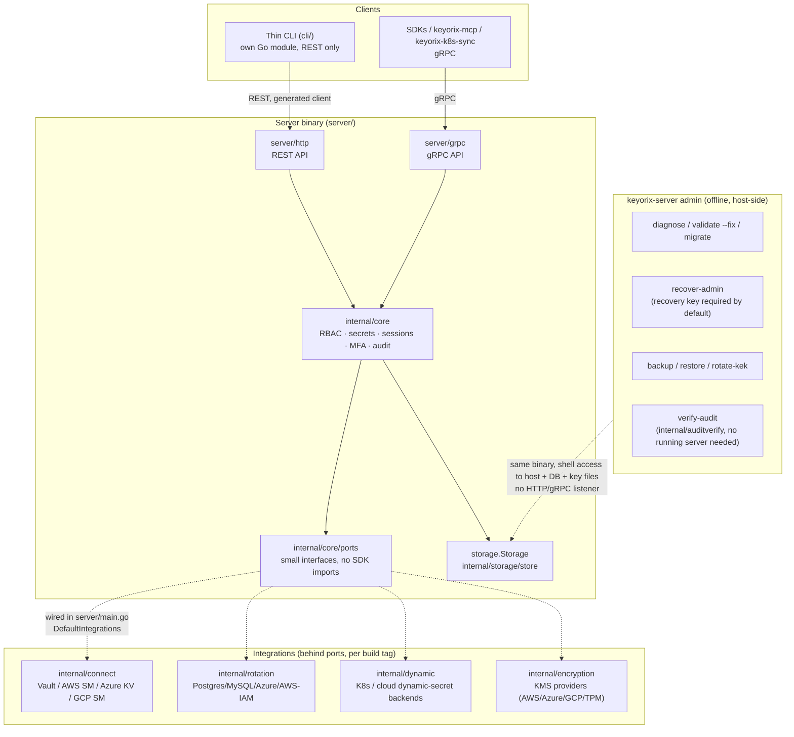

# Architecture

One-page map of how a request or an operator command reaches Keyorix, and how the
pieces are built. See `docs/adr-108-cli-server-split.md` and
`docs/adr-109-core-depends-on-interfaces.md` for the decisions and measurements behind
this shape; `docs/security/architecture.md` for the encryption/authentication design
inside the server itself.

## The four layers

1. **Thin CLI (`keyorix`, `cli/`)** — its own Go module. Talks to a server only over
   the public REST API; its request/response types are generated from the server's own
   OpenAPI document (`server/http/handlers/openapi.yaml`), so it cannot drift from what
   the server actually accepts. It cannot import `internal/core`, `internal/storage`,
   `internal/config`, or any cloud SDK — a dependency-guard test
   (`cli/internal/depguard`) walks the real `go list -deps` graph on every CI run to
   prove it, not just a source grep. No local database mode: every command is a network
   call. A CLI build checks the server's advertised API version and refuses or warns on
   skew (`cli/internal/skew`) rather than silently calling a route the server doesn't
   have.

2. **Server (`server/`)** — one binary, two APIs: the human-facing REST API
   (`server/http`) and gRPC (`server/grpc`) for machine clients (SDKs, `keyorix-mcp`,
   `keyorix-k8s-sync`). Both sit in front of the same `internal/core` service — neither
   API re-implements authorization, audit, or rate limiting; they call into core and let
   it enforce those once. There is no third, lower-trust path: the old `/system`
   storage-proxy tier that let a CLI in "remote" mode bypass the API's own authorization
   is deleted entirely (ADR-083, ADR-108 Decision C), along with the `RemoteStorage`
   backend it existed for.

3. **Core (`internal/core`)** — the service layer: RBAC, secrets, sessions, MFA,
   audit, and every other domain rule. It depends on storage through the
   `storage.Storage` interface (`internal/storage/store` is the only implementation
   today — SQLite or PostgreSQL, chosen by `storage.type`) and on every external
   integration — connectors, credential rotation backends, dynamic-secret engines, the
   KMS/encryption provider, timestamp notary, SAML — through small interfaces in
   `internal/core/ports`, not by importing the integration packages directly
   (ADR-109). `server/main.go`'s `DefaultIntegrations` is the one place real
   implementations get wired in; a feature enabled in config with no implementation
   wired fails the server's boot loudly, never silently at request time.

4. **Integrations, registered per build tag** — `internal/connect` (Vault, AWS/Azure/GCP
   secret managers), `internal/rotation`, `internal/dynamic`, and `internal/encryption`'s
   cloud-KMS providers each carry a `noaws`/`noazure`/`nogcp`/`novault`/`nok8s` build tag
   per cloud backend. Compiling a tag out doesn't just skip building that backend — a
   server config that tries to *enable* a compiled-out backend refuses to start, naming
   the tag, rather than booting into a silently-degraded state (verified per tag by a
   dedicated fail-closed test in each integration package plus `server/`-level
   boot-refusal tests).

## Deleted: the old three-mode CLI

Before ADR-108, `keyorix` embedded the whole server stack (core, storage, every cloud
SDK) and ran in two modes: **local** (opened the SQLite DB directly, bypassing the API's
authorization/audit/rate limits — a second, unaudited server) and **remote** (called
`RemoteStorage`, which proxied onto the `/system` tier). Both are gone. The thin CLI
above is the only CLI; anything that used to need host/DB access directly is now a
`keyorix-server admin` subcommand instead (below).

## `keyorix-server admin`: offline, host-side operations

Some operations must not — or cannot — go through the network API: the server can't
start, every admin account is locked out, an operation needs the database to itself, or
a compliance auditor needs to verify the audit chain without trusting a running server.
These are subcommands of the **server** binary (it already links core and storage), never
a third binary, and never a network endpoint:

- `diagnose` / `validate --fix` / `migrate` — a server that won't boot: broken config,
  bad file permissions, pending schema migrations.
- `recover-admin` — every admin locked out. Requires a 256-bit recovery key by default
  (`admin recovery-key rotate` generates one; there is no network path to bypass this).
  Every use writes to the audit chain and notifies every current admin. A keyless,
  host-access-only mode exists only when explicitly configured (`security.
  recover_admin.insecure_keyless_admin_recovery`, formerly `keyless_mode`), and every boot with it enabled logs a loud warning and
  an audit event.
- `backup` / `restore` / `encryption rotate-kek` — offline backup/restore and a full
  KEK re-encryption sweep, run with the database to itself.
- `verify-audit` — re-derives the tamper-evident audit hash chain directly from a
  database file (`internal/auditverify`), independent of, and without trusting, any
  running server.

No `admin` command ever starts an HTTP or gRPC listener. Owning the host is the
authority for all of them — the opposite of the old `/system` proxy tier, where holding
a machine credential over the network was enough.

## Full vs. air-gapped build profiles

Every integration's cloud backend is behind its own build tag (`noaws`, `noazure`,
`nogcp`, `novault`, `nok8s`) today. The **full** server build compiles all of them in.
An **air-gapped** profile (`-tags noaws,noazure,nogcp`) compiles out every AWS/Azure/GCP
SDK entirely — not just the largest ones — for a customer who runs no cloud connectors,
rotation backends, or cloud KMS: a materially smaller, cloud-SDK-free binary and SBOM,
with the same fail-closed behavior above if a compiled-out backend is ever configured.
Vault and Kubernetes support stay in the air-gapped profile (Vault has no official Go
SDK to exclude; the Kubernetes dynamic-secrets backend is hand-rolled REST, not
`client-go`).

CI builds, tests, and publishes an SBOM for both profiles, and posts a full-vs-air-gapped
dependency-count and binary-size diff as a job summary on every release-dry-run — see
`docs/adr-109-core-depends-on-interfaces.md`'s "Step 6" section for the measured numbers
(999→662 total packages, 145→0 cloud-SDK packages, 67.8MB→46.0MB binary) once that work
lands. As of this page, that measured full air-gapped profile (and the CI wiring that
produces it) is in an open, stacked PR series (#2218→#2223) — not yet on `main`. What
*is* on `main` today is a narrower, older `-tags lean` build (excludes only
`rotation`'s AWS-IAM backend and the evidence-sink/object-store connectors, not a
complete cloud-SDK exclusion) and the per-package `noaws`/`noazure`/`nogcp` build-tag
infrastructure the new profile is built from.
