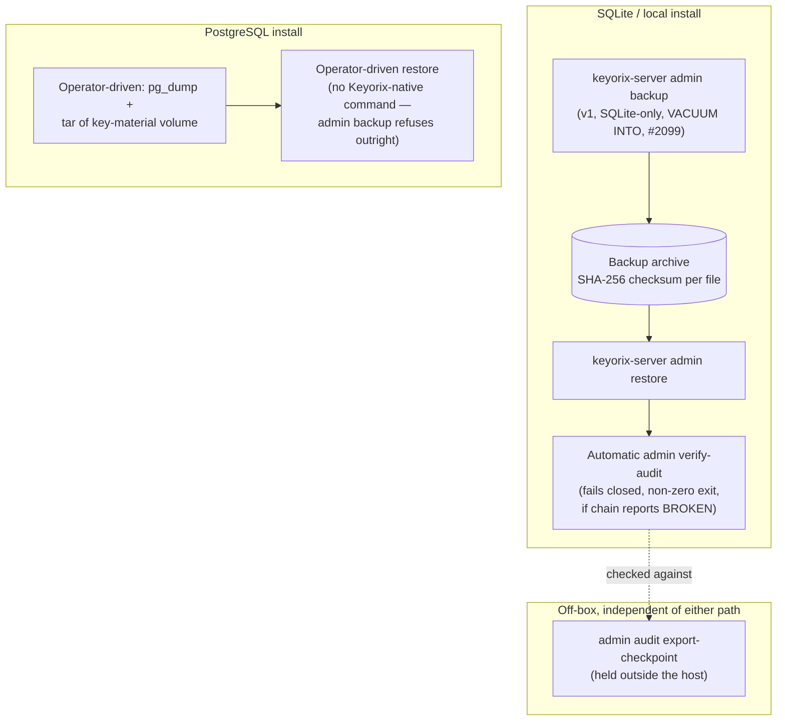

# Threat Model: Backup and Restore

> Part of [`docs/security/threat-models/`](README.md). Derived from
> [`../threat-model.md`](../threat-model.md) §5.3 and
> [ADR-108](../../adr-108-cli-server-split.md) decision B3. Covers both
> the shipped SQLite path and the operator-driven Postgres path — these
> have materially different maturity and this document says so plainly
> rather than describing only the more complete one.

## 1. System context

Two distinct backup paths exist today, at different levels of maturity:
a Keyorix-native command for SQLite/local installs, and an
operator-driven manual process for PostgreSQL-backed installs.

## 2. Trust boundaries

| Boundary | What it protects against | What it doesn't |
|---|---|---|
| Archive checksum (SHA-256 per file) | **Corruption** — proves the archive wasn't damaged in transit/storage | **Not tampering** — anyone who can edit the archive can recompute a matching checksum |
| `admin restore`'s automatic `verify-audit` | Restoring a tampered or truncated audit chain — fails closed (non-zero exit) if the chain reports BROKEN | A chain tampered *and* re-signed with a valid checkpoint (requires the checkpoint key, which requires KEK access — see [secret-storage-key-hierarchy.md](secret-storage-key-hierarchy.md)) |
| Off-box checkpoint export (`--anchor`) | The one check that constrains even a host admin who holds both the database and its checkpoint signing key | Nothing if the export itself is never taken or is also compromised |

## 3. STRIDE

- **Information disclosure — stolen backup.** A stolen database (dump or
  `admin backup` archive) alone is encrypted ciphertext under a DEK
  itself wrapped by the KEK — unreadable without the key material. A
  stolen key-material volume alone is useless without the database it
  wraps keys for. **Both together, plus the master passphrase** (for a
  file-KEK install) is a complete offline compromise, equivalent to host
  root — see [secret-storage-key-hierarchy.md](secret-storage-key-hierarchy.md).
  For a KMS/HSM-backed install, the attacker still needs the external
  KMS boundary, so a stolen backup pair alone is *not* sufficient.
- **Tampering — archive integrity vs. authenticity (distinct, and
  distinguished honestly).** The checksum proves the archive wasn't
  **corrupted**; it does not prove it wasn't **tampered with**. That's a
  job for the audit hash chain instead: `admin restore` runs
  `admin verify-audit` automatically and fails closed if the chain
  reports BROKEN.
- **Tampering — no artifact-level encryption beyond the wrapped DEK.**
  `admin backup` adds checksum integrity and an audit-chain-verified
  restore path, but a stolen archive's confidentiality still reduces to
  the same KEK-custody analysis as before the command existed — there is
  no additional Keyorix-native encryption layer wrapping the archive
  itself.
- **Availability — PostgreSQL has no Keyorix-native backup command at
  all.** `admin backup` refuses outright for a Postgres-backed
  deployment rather than attempt an unsupported backend — this is a
  deliberate fail-closed refusal, not a silent gap, but it does mean a
  Postgres operator's backup posture depends entirely on their own
  `pg_dump` + key-volume-copy discipline, with no Keyorix tooling
  checking that both halves were actually taken together.

## 4. Residual risks, stated honestly

- **SQLite → PostgreSQL backend migration is a decided design, not yet
  implemented.** ADR-108 names this explicitly: "Implemented for
  backup/restore (SQLite) and KEK re-encryption. SQLite→PostgreSQL move
  not yet implemented" —
  [`docs/design-b3-backup-v2.md`](../../design-b3-backup-v2.md) (PR
  #2100, merged, Status: Decided) is the complete, already-decided
  design for a backend-neutral archive format (HMAC-authenticated
  manifests, a Postgres `REPEATABLE READ` snapshot mechanism, a new
  archive format) that closes this gap. Implementation hasn't started
  beyond a related security fix (PR #2233). This is not a
  product-decision gap — the design is already decided — but a real,
  not-yet-built feature, tracked via its own design doc rather than a
  GitHub issue this document needs to file separately.
- **PostgreSQL's backup path has no Keyorix-native artifact at all**
  (above) — carried forward from `../threat-model.md` §5.3 rather than
  re-derived.
