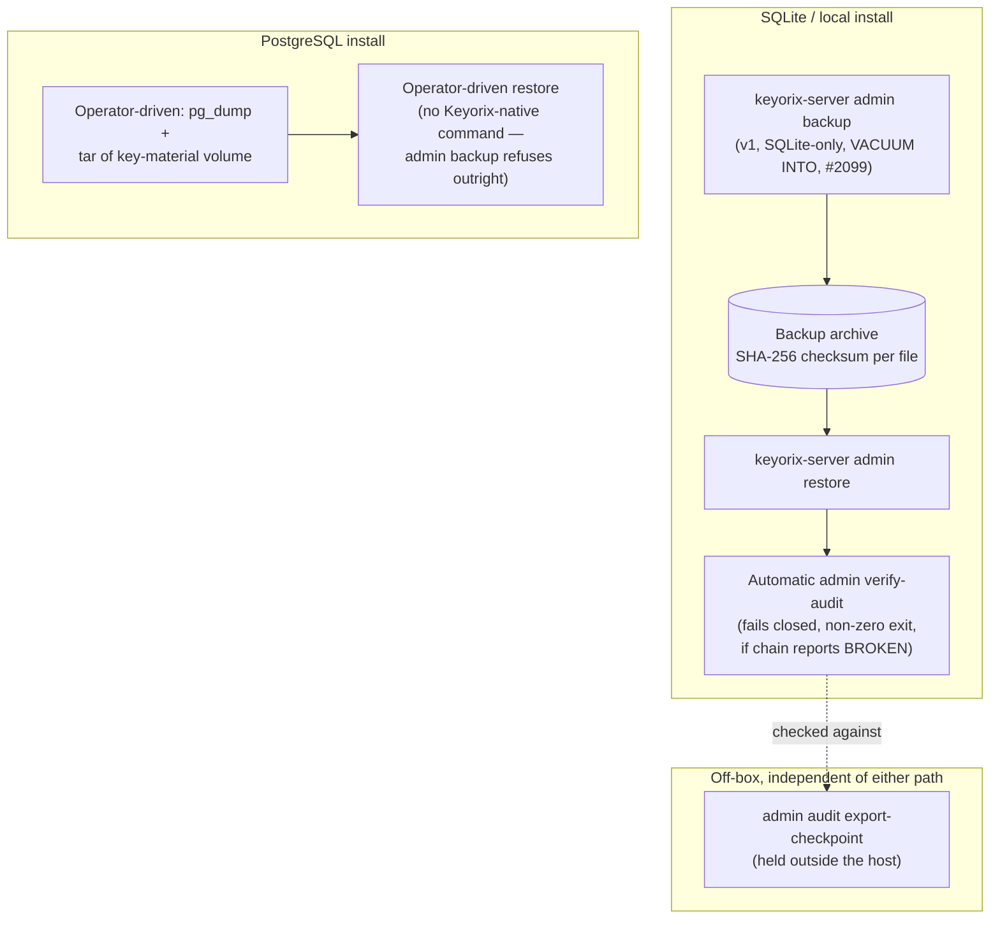

# Threat Model: Backup and Restore

> Part of [`docs/security/threat-models/`](README.md). Derived from
> [`../threat-model.md`](../threat-model.md) §5.3 and
> [ADR-108](../../adr-108-cli-server-split.md) decision B3. Covers both
> the shipped SQLite path and the operator-driven Postgres path — these
> have materially different maturity and this document says so plainly
> rather than describing only the more complete one.

## 1. System context

Two distinct backup paths exist today, at different levels of maturity:
a Keyorix-native command for SQLite/local installs, and an
operator-driven manual process for PostgreSQL-backed installs.

## 2. Trust boundaries

| Boundary | What it protects against | What it doesn't |
|---|---|---|
| Archive checksum (SHA-256 per file) | **Corruption** — proves the archive wasn't damaged in transit/storage | **Not tampering** — anyone who can edit the archive can recompute a matching checksum |
| `admin restore`'s automatic `verify-audit` | Restoring a tampered or truncated audit chain — fails closed (non-zero exit) if the chain reports BROKEN | A chain tampered *and* re-signed with a valid checkpoint (requires the checkpoint key, which requires KEK access — see [secret-storage-key-hierarchy.md](secret-storage-key-hierarchy.md)) |
| Off-box checkpoint export (`--anchor`) | The one check that constrains even a host admin who holds both the database and its checkpoint signing key | Nothing if the export itself is never taken or is also compromised |

## 3. Threat table

| ID | STRIDE | Description | Mitigation | Evidence link | Residual risk / GAP |
|---|---|---|---|---|---|
| BAK-1 | Information disclosure | A stolen backup (dump or `admin backup` archive), or a stolen key-material volume, exposes secret values. | Each alone is insufficient: the database is encrypted ciphertext under a DEK wrapped by the KEK; the key-material volume is useless without the database it wraps keys for. | [secret-storage-key-hierarchy.md](secret-storage-key-hierarchy.md) | **Both together, plus the master passphrase** (file-KEK install) is a complete offline compromise, equivalent to host root. A KMS/HSM-backed install additionally requires the external KMS boundary, so a stolen pair alone is *not* sufficient there. |
| BAK-2 | Tampering | A restored archive was modified after backup, not merely corrupted. | The SHA-256 checksum only proves the archive wasn't **corrupted** — it does not prove it wasn't **tampered with** (anyone who can edit the archive can recompute a matching checksum). `admin restore` runs `admin verify-audit` automatically and fails closed (non-zero exit) if the chain reports BROKEN. | ADR-108 §B3 | A chain tampered *and* re-signed with a valid checkpoint would pass — requires the checkpoint key, which requires KEK access (see [secret-storage-key-hierarchy.md](secret-storage-key-hierarchy.md)). The off-box checkpoint export (`--anchor`) is the check that constrains even that actor. |
| BAK-3 | Information disclosure | The backup archive itself carries no encryption layer beyond what the wrapped DEK already provides. | None beyond the DEK/KEK analysis in BAK-1 — stated as a real limitation, not papered over. | `../threat-model.md` §5.3 | **Open.** No Keyorix-native artifact-level encryption exists beyond the wrapped DEK; a stolen archive's confidentiality reduces entirely to BAK-1's analysis. |
| BAK-4 | Availability | A PostgreSQL-backed deployment has no Keyorix-native backup/restore command, leaving backup posture entirely to operator discipline. | `admin backup` refuses outright for Postgres rather than attempt an unsupported backend — a deliberate fail-closed refusal. | ADR-108 §B3 | **Open, by design, not tracked as a bug.** A Postgres operator's `pg_dump` + key-volume-copy discipline has no Keyorix tooling checking both halves were taken together. |

## 4. Residual risks, stated honestly

- **SQLite → PostgreSQL backend migration is a decided design, not yet
  implemented.** ADR-108 names this explicitly: "Implemented for
  backup/restore (SQLite) and KEK re-encryption. SQLite→PostgreSQL move
  not yet implemented" —
  [`docs/design-b3-backup-v2.md`](../../design-b3-backup-v2.md) (PR
  #2100, merged, Status: Decided) is the complete, already-decided
  design for a backend-neutral archive format (HMAC-authenticated
  manifests, a Postgres `REPEATABLE READ` snapshot mechanism, a new
  archive format) that closes this gap. Implementation hasn't started
  beyond a related security fix (PR #2233). This is not a
  product-decision gap — the design is already decided — but a real,
  not-yet-built feature, tracked via its own design doc rather than a
  GitHub issue this document needs to file separately.
- **PostgreSQL's backup path has no Keyorix-native artifact at all**
  (above) — carried forward from `../threat-model.md` §5.3 rather than
  re-derived.
