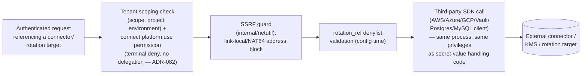

# Threat Model: Connectors and Rotation Targets

> Part of [`docs/security/threat-models/`](README.md). Derived from
> [`../threat-model.md`](../threat-model.md) §4 (boundary B7) and
> [`../SECURE-CODING.md`](../SECURE-CODING.md) §10.
>
> **Naming note.** The task this document was written from referred to
> this component as "connector host (ADR-111, proposed)." Neither that
> ADR number nor a "connector host" concept — a dedicated, isolated
> execution environment for connector code, distinct from the main
> server process — exists anywhere in this repository as of this
> writing (confirmed by a repo-wide search). This document is named
> "Connectors" to describe what's actually shipped, and the absence of
> any process-level isolation is recorded as an open gap in §4 rather
> than described as if it already existed under a different name.

## 1. System context

Every outbound call to an external connector, KMS, or rotation target
(AWS/Azure/GCP SDKs, HashiCorp Vault, Postgres/MySQL rotation targets)
runs inside the main `keyorix-server` process — there is no separate
connector process or sandbox. Authorization scoping and SSRF guarding
happen at the call site, inside that same process.

## 2. Trust boundaries

| Boundary (from `../threat-model.md` §3) | What crosses it |
|---|---|
| B7 — Server ↔ external connectors/KMS/rotation targets | Outbound calls carrying operator-configured credentials |

## 3. Threat table

| ID | STRIDE | Description | Mitigation | Evidence link | Residual risk / GAP |
|---|---|---|---|---|---|
| CONN-1 | Server-side request forgery | A connector/rotation-target/dynamic-secret config is pointed at an internal/link-local address to reach an otherwise-unreachable internal service. | Link-local/NAT64 address guards on outbound calls, actively fuzzed. | `internal/netutil`; `internal/core/dynamic_secrets_ssrf_test.go`, `internal/core/admin_dsn_ssrf_fuzz_test.go`; `FuzzAzureGenerateUpstreamRef`, `FuzzPostgresQuoting`, `FuzzMySQLQuoteString` | None identified in the reviewed surfaces today. This is the exact class that already produced one real, shipped, fixed path-traversal vulnerability in `rotation_ref` handling, now additionally denylist-validated at configuration time. |
| CONN-2 | Elevation of privilege / information disclosure | A caller reaches a connector outside their authorized `(scope, project, environment)`. | Connectors are scoped to `(scope, project, environment)`, with ownership enforcement and `ListConnectors` filtering by the caller's authorized scope, plus a dedicated `connect.platform.use` permission gated as a **terminal deny** with no delegation fallback. | ADR-082 (all four implementation branches shipped) | None identified after ADR-082's three rounds of revision — the ADR's own "Out of scope" section names what's deliberately deferred. |
| CONN-3 | Spoofing | A connector's OIDC/federation trust is compromised via a signing-key MITM. | Same `jwks_uri`/issuer guards as [authentication.md](authentication.md) AUTH-4, regardless of which component performs the federation. | [authentication.md](authentication.md) | None identified. |
| CONN-4 | Elevation of privilege / tampering | A vulnerability in a third-party connector SDK (not an attacker-controlled input — a compromised/buggy dependency) runs with the same process privileges as secret-handling code. | None today — see §4. | — | **Open.** Filed as [#2734](https://github.com/keyorixhq/keyorix/issues/2734) (`threat-model-gap`). |

## 4. Residual risks, stated honestly

- **No process-level isolation between connector code and
  secret-handling code.** Everything in §3 defends against a
  *malicious input* reaching a connector call — it does not defend
  against a *compromised dependency* (a vulnerability in the AWS/Azure/
  GCP SDK itself, for example) running with the same process privileges
  as the code that holds the KEK/DEK and decrypted secret values. There
  is no sandboxing, separate process, or separate container boundary
  between connector execution and the rest of the server today. Filed
  as [#2734](https://github.com/keyorixhq/keyorix/issues/2734)
  (`threat-model-gap`) — this is a design-exploration gap, not a known
  exploit; whether the engineering cost of a sandboxed
  connector-execution model is worth it is a product decision for
  Andrei, not something this document prescribes.
- **No Keyorix-native network egress-policy layer.** Per
  `../architecture.md` §6: outbound reachability is bounded by the
  per-call SSRF guards above and by the operator's own network/firewall
  configuration, not by an application-level allow/deny-list of
  destinations. Stated as a deliberate scope boundary, not an oversight.
