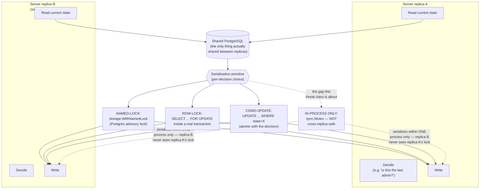

# Threat Model: HA Consistency (Cross-Replica Check-Then-Act Races)

> Part of [`docs/security/threat-models/`](README.md). Derived from
> [`../../specs/check-then-act-inventory.md`](../../specs/check-then-act-inventory.md)
> (GUARD-2) and `internal/core/INVARIANTS.md`'s INV-CORE-41.
>
> **Why this is its own threat class.** A competitor survey of published
> secrets-manager security models found none that model this class at
> all: a security-relevant decision that reads current state, decides,
> then writes is only as safe as its *serialization*, and a decision
> serialized by an in-process `sync.Mutex` passes every unit test (SQLite
> is inherently single-connection) and still fails silently the instant a
> second replica of an HA deployment (ADR-039) takes the next request.
> This document exists because that failure mode is invisible to every
> testing approach that doesn't specifically construct two independent
> database connections racing the same decision.

## 1. System context

## 2. Trust boundaries

This is not a boundary between an attacker and a defender in the usual
sense — both replicas are legitimate, trusted server processes. The
"threat" is a **race between two trusted actors**, not an adversary: two
simultaneous legitimate requests, routed by a load balancer to different
replicas, both deciding based on state that becomes stale the instant
the other one writes. This is why it's modeled separately from the rest
of this threat-model corpus, which is built around an adversarial actor.

## 3. Threat table

| ID | STRIDE | Description | Mitigation | Evidence link | Residual risk / GAP |
|---|---|---|---|---|---|
| HA-1 | Tampering (via race, not malice) — last-admin lockout bypass | Two concurrent deactivation requests across two replicas could both see "not the last admin" and both proceed, leaving zero admins. | `storage.WithNamedLock(ctx, lastAdminGuardLockKey, ...)` wraps the check+write for the direct API path (`SuspendUser`/`UpdateUser`/`DeleteUser`). | `account_state.go:209`, `users.go:584,802`; `concurrency_2352_lastadmin_guard_sweep_postgres_test.go` | Closed for the direct API path. **Open for SCIM** — see HA-6 below. |
| HA-2 | Elevation of privilege via race — separation-of-duties (SoD) bypass | Two concurrent role-grant requests could each independently pass a SoD preventive check that would have failed had either seen the other's pending grant. | `storage.WithNamedLock(ctx, sodGrantLockKey(...), ...)` for user, group, and (after this same inventory pass) machine-identity role grants. | `rbac_management.go:536-556` (user), `:218-521` (group); `machine_token.go:429-448`+`sod.go:752-792` (machine, **fixed during the GUARD-2 pass itself** — was previously NONE); `concurrency_sod_grant_postgres_test.go`, `concurrency_sod_group_grant_postgres_test.go`, `concurrency_sod_machine_grant_postgres_test.go` | None identified — all three grant paths now share the same lock-key pattern. |
| HA-3 | Tampering via race — lost update on secret rotation | Two replicas rotating the same secret concurrently could both write a new version, silently losing one. | `storage.WithNamedLock` (`storage.EnvironmentSecretGuardLockKey`) + a DB unique index on `(secret_node_id, version_number)` — belt-and-suspenders: the lock prevents the race in the common case, the unique constraint makes a successful double-write structurally impossible even if the lock were somehow bypassed. | `secrets.go:51`; `cross_replica_ops_fuzz_test.go` oracle c (genuine two-replica fuzzer — see §4 for why this specific harness shape matters) | None identified. |
| HA-4 | Information disclosure via race — revoked credential still valid on next read | A session/PAT/machine-token revoke on replica A must be honored by replica B's very next read, not after some cache-refresh delay. | A plain conditional `UPDATE ... WHERE id=?` revoke write, with **no caching at the core layer** — Postgres `READ COMMITTED` alone gives the bound. Verified as "0 staleness," not a TTL-bounded approximation, via a linearizability check. | `account_sessions.go`, `pat.go`, `machine_token.go`; `cross_replica_ops_fuzz_test.go` oracle b | None identified. |
| HA-5 | Tampering via race — install-wide bootstrap creating two admins | Two replicas racing first-boot bootstrap could each create an admin account, violating "exactly one admin on fresh install." | `storage.WithBootstrapLock` — a Postgres advisory lock around the whole bootstrap sequence. | `auth_bootstrap.go`; `concurrency_bootstrap_cross_replica_postgres_test.go` | None identified. See §4 for a related test-quality lesson from this exact mechanism's history. |
| HA-6 | Tampering via race — SCIM last-admin deactivation | `UpdateSCIMUser`/`DeprovisionSCIMUser` serialize only via an **in-process** mutex (`accountStateMu`), not the cross-replica `WithNamedLock` the direct-API path (HA-1) uses — self-documented in-code as a deferred gap. | None at the time of the GUARD-2 inventory pass beyond the in-process mutex. | `scim.go:255-269,422-435,505-515`; inventory row #2 in `docs/specs/check-then-act-inventory.md` | **Open, named explicitly.** The inventory's own correct-fix recommendation is to reuse `lastAdminGuardLockKey` (the same key HA-1 already uses, not a new one) rather than invent a parallel mechanism. This should be verified against current code before relying on it — the inventory document is a point-in-time artifact; if this has since been fixed, this row should be updated, not silently trusted as still-open. |

## 4. The structural guard and why its history is itself instructive

Beyond the per-decision fixes above, two standing mechanisms exist so
this bug class doesn't require re-discovery on every new feature:

- **A reusable two-replica test harness**
  (`internal/core/concurrency_race_harness_test.go`) and a **genuine
  stateful two-replica fuzzer** (`internal/core/cross_replica_ops_fuzz_test.go`,
  `FuzzCrossReplicaOps`) that construct two `*KeyorixCore` instances, each
  with its **own** `*gorm.DB` connection pool, sharing one real
  PostgreSQL schema — built through the real production migration path
  (`internal/storage.MigrateExisting`), not `AutoMigrate`. This multi-pool
  shape matters specifically because two wrappers over *one* shared
  `*gorm.DB` (or SQLite) share a process-local mutex that would serialize
  every goroutine regardless of whether the mechanism under test works
  at all — a test built the easy way here would pass unconditionally and
  prove nothing.
- **A structural AST guard going forward**
  (`internal/core/check_then_act_lock_guard_test.go`), with exemptions
  tracked in `docs/check-then-act-lock-exempt.tsv` for decisions where
  the worst case is availability/UX, not a security bypass. The
  invariant is recorded as `internal/core/INVARIANTS.md`'s **INV-CORE-41**.
- **CI wiring** (`.github/workflows/pg-race-tests.yml`) ensures every
  pg-gated test in this family actually runs against real Postgres on a
  PR touching `internal/core`/`internal/storage`, not only on a
  merge-queue/full-CI run.

**The instructive history, stated because it generalizes beyond this one
mechanism:** this repository's own prior experience with exactly this
test shape is that a two-replica test can *look* like it proves
cross-replica safety while actually sharing one process-local mutex —
the original `TestConcurrency_BootstrapSystem_CrossReplicaExactlyOneAdmin`
did exactly this, handing every simulated "replica" the same shared
`storage.Storage` instance, so it would have passed identically even
with the Postgres advisory lock deleted outright. The fix was
structural (multiple independent `*gorm.DB` connections, not multiple
wrapper objects sharing one), not a stronger assertion on the same
fixture. Every harness cited in this document (§3, §4) was built or
re-verified against that specific failure mode.

## 5. Residual risks, stated honestly

- **HA-6 (SCIM last-admin) is the one confirmed open gap** in this
  threat class as of the GUARD-2 inventory's writing. It is a known,
  named, self-documented-in-code gap with a specific recommended fix
  (reuse the existing lock key), not an unknown.
- **This inventory's scope is `internal/core`**, cross-referenced
  against `internal/storage/store`'s row-lock primitives. It is not a
  claim that every check-then-act decision anywhere in the codebase
  (e.g. in `server/http` directly, bypassing `internal/core`) has been
  inventoried — the inventory document's own "Scope" section states
  this explicitly.
- Three rows in the full inventory (secret-dependency exclusive
  creation, membership lifecycle, setup-token consumption) are marked
  "not independently re-verified this pass" in the source inventory —
  carried forward here as an honest caveat rather than claimed as fully
  checked.
