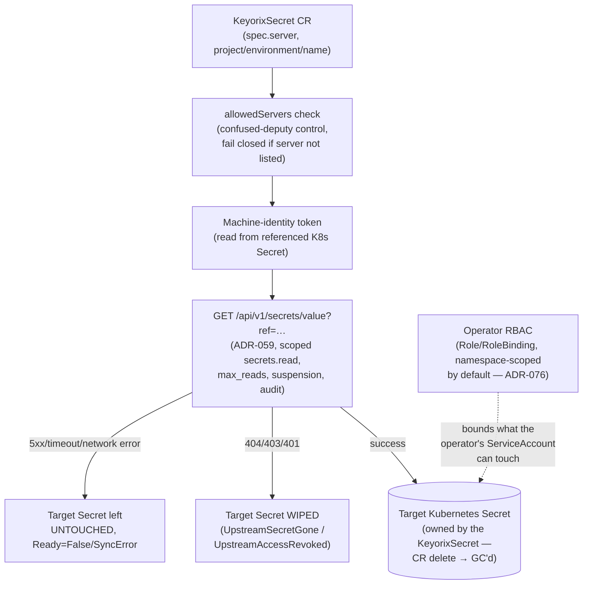

# Threat Model: Kubernetes Operator

> Part of [`docs/security/threat-models/`](README.md). Derived from
> [`../../k8s-operator.md`](../../k8s-operator.md),
> [ADR-076](../../adr-076-operator-rbac-scope.md), and
> [`../threat-model.md`](../threat-model.md) §4 (boundary B6). The
> operator is one of three delivery mechanisms (alongside the sync
> agent and the External Secrets Operator integration) — this document
> covers the operator specifically; the other two share the same
> underlying API-read path and the same "never log values" property.

## 1. System context

The operator reconciles `KeyorixSecret` custom resources into native
Kubernetes Secrets. It never holds a long-lived credential of its own
beyond the machine-identity token referenced by each CR, and every value
read goes through the same authorized API every other client uses.

## 2. Trust boundaries

| Boundary (from `../threat-model.md` §3) | What crosses it | Enforcement |
|---|---|---|
| B6 — k8s-sync / operator / ESO ↔ server | Machine-identity token, by-reference secret reads | Same `core.Authorize` chokepoint as any client; least-privilege namespace-scoped RBAC on the Kubernetes side |

## 3. STRIDE

- **Spoofing — confused deputy (a CR pointing at an untrusted
  server).** `allowedServers` is required for the operator to sync
  anything: a `KeyorixSecret`'s `spec.server` must match one of the
  configured trusted base URLs, or the reconciler rejects the CR
  outright (fail closed). Without it, the controller starts fine and
  the pod goes `Ready`, but every `KeyorixSecret` fails with
  `Ready=False`/`SyncError` — a deliberately loud failure mode, not a
  silent one, though the help text notes it's easy to miss since
  nothing about the install itself looks broken.
- **Elevation of privilege via over-broad RBAC.** The operator defaults
  to a single-namespace `Role`/`RoleBinding`, least-privilege by
  default — an unmodified `helm install` never grants access to Secrets
  outside the install namespace (ADR-076). Two opt-in modes (bounded
  multi-namespace, cluster-wide) are both resolved from the same shared
  helper so they can never disagree with each other, and are mutually
  exclusive by construction — setting both makes the chart refuse to
  render rather than silently picking one. *Residual*: an operator who
  opts into cluster-wide watch accepts a correspondingly larger RBAC
  surface — a documented, deliberate tradeoff stated at install time,
  not a silent default.
- **Tampering / partial writes on sync failure.** A **transient**
  failure (network error, timeout, 5xx) leaves the target Secret
  completely untouched — no partial write, no wipe; `Ready` goes
  `False`/`SyncError` and the controller backs off and retries. An
  **affirmatively-gone-or-revoked** signal (404/403, or 401 which in
  practice means the token was revoked/rotated) **wipes** the target
  Secret rather than leaving it stale — a deliberate choice: leaving a
  previously-synced plaintext value sitting in the cluster indefinitely
  after access was deliberately cut would be a worse outcome than a
  workload losing the Secret it depends on.
- **Information disclosure.** All three delivery mechanisms (operator,
  sync agent, ESO) read over the same authorized API, honoring
  `max_reads`, suspension, and audit, and never log values.
- **Denial of service — upgrade-time RBAC regression.** A chart upgrade
  across the cluster-wide-default → namespace-scoped-default boundary
  (ADR-076) could silently narrow an existing install's effective
  reach if the operator relied on the old default. Mitigated by a hard
  render-time block: the chart refuses to render at all if the
  now-rejected `rbac.clusterScoped=true` + `watchNamespaces` combination
  is detected (carried forward from a prior release's recorded values),
  rather than silently applying a narrower RBAC scope than the operator
  expects.

## 4. Residual risks specific to this component

No residual risk beyond what's stated above (the cluster-wide-watch
tradeoff, taken deliberately and explicitly by the operator who opts
into it) is identified for this component specifically. System-wide
residuals (transient in-process secret exposure, the authentication
cache window) apply here too via the shared API read path but are not
re-derived — see [server-api.md](server-api.md) and
[secret-storage-key-hierarchy.md](secret-storage-key-hierarchy.md).
