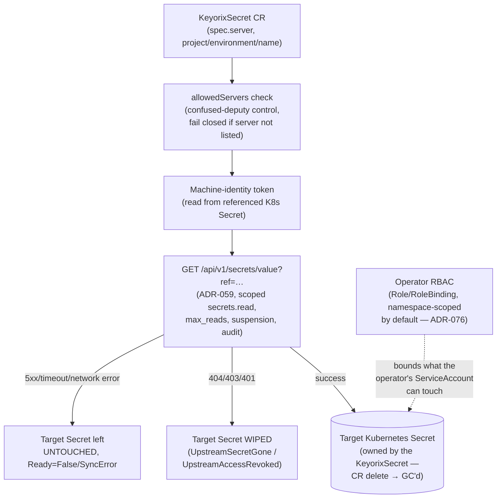

# Threat Model: Kubernetes Operator

> Part of [`docs/security/threat-models/`](README.md). Derived from
> [`../../k8s-operator.md`](../../k8s-operator.md),
> [ADR-076](../../adr-076-operator-rbac-scope.md), and
> [`../threat-model.md`](../threat-model.md) §4 (boundary B6). The
> operator is one of three delivery mechanisms (alongside the sync
> agent and the External Secrets Operator integration) — this document
> covers the operator specifically; the other two share the same
> underlying API-read path and the same "never log values" property.

## 1. System context

The operator reconciles `KeyorixSecret` custom resources into native
Kubernetes Secrets. It never holds a long-lived credential of its own
beyond the machine-identity token referenced by each CR, and every value
read goes through the same authorized API every other client uses.

## 2. Trust boundaries

| Boundary (from `../threat-model.md` §3) | What crosses it | Enforcement |
|---|---|---|
| B6 — k8s-sync / operator / ESO ↔ server | Machine-identity token, by-reference secret reads | Same `core.Authorize` chokepoint as any client; least-privilege namespace-scoped RBAC on the Kubernetes side |

## 3. Threat table

| ID | STRIDE | Description | Mitigation | Evidence link | Residual risk / GAP |
|---|---|---|---|---|---|
| K8S-1 | Spoofing (confused deputy) | A `KeyorixSecret` CR points `spec.server` at an untrusted/attacker-controlled server, and the operator syncs from it. | `allowedServers` is required for the operator to sync anything: `spec.server` must match a configured trusted base URL, or the reconciler rejects the CR outright (fail closed). | `../../k8s-operator.md` § Install | None identified. A misconfigured install (forgot to set `allowedServers`) fails loudly (`Ready=False`/`SyncError` on every CR) rather than silently syncing from an untrusted source. |
| K8S-2 | Elevation of privilege | The operator's RBAC grants access to Secrets beyond what it actually needs to reconcile. | Single-namespace `Role`/`RoleBinding` by default — least-privilege; two opt-in modes (bounded multi-namespace, cluster-wide) resolved from one shared helper so they can never disagree, and mutually exclusive by construction (the chart refuses to render if both are set). | ADR-076 | An operator who opts into cluster-wide watch accepts a correspondingly larger RBAC surface — a documented, deliberate tradeoff stated at install time, not a silent default. |
| K8S-3 | Tampering / availability | A sync failure leaves a partially-written or stale-but-undetectable Secret in the cluster. | A **transient** failure (network error, timeout, 5xx) leaves the target Secret completely untouched — no partial write; `Ready` goes `False`/`SyncError`. An **affirmatively-gone-or-revoked** signal (404/403/401) **wipes** the target Secret instead of leaving it stale. | `../../k8s-operator.md` § How it works | None identified — the wipe-on-revoke choice is deliberate: leaving a previously-synced plaintext value in the cluster after access was cut is judged worse than a workload losing the Secret it depends on. |
| K8S-4 | Information disclosure | A secret value is logged or exposed outside the authorized read path during delivery. | All three delivery mechanisms (operator, sync agent, ESO) read over the same authorized API, honoring `max_reads`, suspension, and audit, and never log values. | `../../k8s-operator.md` | None identified. |
| K8S-5 | Denial of service / elevation of privilege | A chart upgrade across the cluster-wide-default → namespace-scoped-default boundary silently narrows (or an inconsistent combination silently widens) an existing install's RBAC reach. | The chart refuses to render at all if the now-rejected `rbac.clusterScoped=true` + `watchNamespaces` combination is detected (carried forward from a prior release's recorded values) — a hard block, not a silent apply. | ADR-076 | None identified. |

## 4. Residual risks specific to this component

No residual risk beyond what's stated above (the cluster-wide-watch
tradeoff, taken deliberately and explicitly by the operator who opts
into it) is identified for this component specifically. System-wide
residuals (transient in-process secret exposure, the authentication
cache window) apply here too via the shared API read path but are not
re-derived — see [server-api.md](server-api.md) and
[secret-storage-key-hierarchy.md](secret-storage-key-hierarchy.md).
