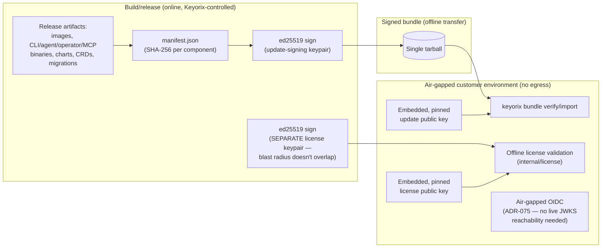

# Threat Model: Update Bundles (Air-Gapped)

> Part of [`docs/security/threat-models/`](README.md). Derived from
> [`../architecture.md`](../architecture.md) §8. Covers the mechanisms
> that let an air-gapped deployment — no outbound internet access at
> all — still update and license itself without ever phoning home.

## 1. System context

An internet-connected secrets manager would normally check for updates
and validate licenses against a vendor server. Keyorix's default
operating mode has no such outbound dependency; three mechanisms extend
that to updates and licensing specifically, each using asymmetric
signing so the customer never needs to hold (or trust a channel
delivering) a shared secret.

## 2. Trust boundaries

| Boundary | Enforcement |
|---|---|
| Bundle authenticity | `ed25519` signature verified against an **embedded, pinned** public key — never fetched at verify time, so there's no network call to intercept |
| License authenticity | A **separate** `ed25519` keypair from update signing, so a compromise of one blast radius doesn't extend to the other |
| Component integrity within a bundle | `manifest.json` pins every component (images, binaries, charts, CRDs, migrations) by SHA-256 |
| OIDC federation with no live JWKS reachability | ADR-075 — machine-identity OIDC verification works for Kubernetes/CI environments that themselves have no egress |

## 3. Threat table

| ID | STRIDE | Description | Mitigation | Evidence link | Residual risk / GAP |
|---|---|---|---|---|---|
| UPD-1 | Tampering | An update bundle is substituted or modified in transit (relevant specifically for offline/air-gapped transfer, where no TLS channel protects it). | `ed25519` signature verified against an **embedded, pinned** public key — asymmetric specifically because an air-gapped customer must verify without ever holding the signing secret, unlike the audit chain's symmetric HMAC checkpoints (see [audit-chain.md](audit-chain.md)), which assume the verifier *does* hold the key. `keyorix bundle verify`/`import` reject anything not matching the pinned key. | ADR-062 | None identified. |
| UPD-2 | Spoofing | A forged license token grants access to a commercial-tier-gated feature. | A compact `base64url(payload).base64url(sig)` token evaluated entirely locally against a **second, independent** embedded public key (separate keypair from update signing). | ADR-065 | None identified. |
| UPD-3 | Information disclosure | Update or license verification makes an outbound network call, creating a covert exfiltration channel from an otherwise air-gapped deployment. | Neither mechanism makes any outbound network call at verification time — no phone-home, ever, by design. | ADR-062, ADR-065 | None — this is the one property this document states with full confidence rather than "no instance found," since there is no code path that attempts a network call in either verifier. |
| UPD-4 | Elevation of privilege | The `airgap_updates` commercial-tier gate fails open on a licensing error, letting an unlicensed install import bundles anyway. | Gate exists on `keyorix bundle import`. | `internal/license` | **Not independently re-verified for this document.** See §4 — this document asserts the gate exists but did not trace its fail-closed behavior end-to-end under a corrupted/expired token. |

## 4. Residual risks, stated honestly

- **Implementation completeness is phased and only partially
  independently confirmed.** `../architecture.md` §8 itself states:
  "ADR-062 itself is recorded as 'Accepted (design), implementation
  phased' — the license (Phase 2a/2b/2c) and bundle-verify mechanisms
  above are confirmed present in code (`internal/license`,
  `internal/cli/bundle`); this document does not claim every phase named
  in that ADR's original design is complete, only what is independently
  verified to exist." This threat model inherits that same caveat rather
  than overstating completeness.
- **The commercial-tier gate's fail-closed behavior under a licensing
  error was not independently re-verified while writing this document.**
  This document asserts the gate exists (`airgap_updates`) but did not
  trace its behavior end-to-end under a corrupted/expired license token.
  If this matters for a specific evaluation, trace `internal/license`'s
  gate check directly rather than relying on this document's general
  statement.
