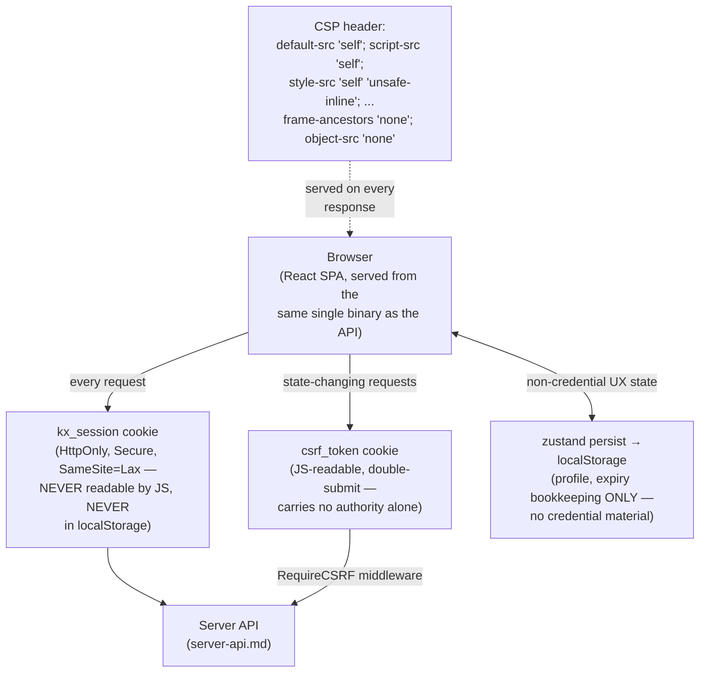

# Threat Model: Web UI

> Part of [`docs/security/threat-models/`](README.md). Derived from
> [`../threat-model.md`](../threat-model.md) §4 (boundary B5) and
> [`../architecture.md`](../architecture.md) §6. This is the one
> component the system-wide threat model's own positioning note flags as
> narrower in scope than the rest: "the rest of the frontend beyond CSP
> and token storage is explicitly out of scope for the 2026-09 review
> and scheduled as its own future pass." That caveat is repeated here
> rather than silently dropped.

## 1. System context

## 2. Trust boundaries

| Boundary (from `../threat-model.md` §3) | What crosses it | Enforcement |
|---|---|---|
| B5 — Web UI ↔ server | Session cookie (`kx_session`) + CSRF double-submit token | `server/middleware/session_cookie.go`; `RequireCSRF`/`csrf.go` |

## 3. Threat table

| ID | STRIDE | Description | Mitigation | Evidence link | Residual risk / GAP |
|---|---|---|---|---|---|
| WEB-1 | Spoofing (session theft via XSS) | An XSS vulnerability lets a script read the session token and exfiltrate it. | The session token is delivered exclusively via an `HttpOnly`, `Secure`, `SameSite=Lax` cookie — never readable by JS, never in `localStorage`. A deliberate migration away from an earlier `localStorage`-token design. | 2026-09 security review, frontend session-token-storage check | The accepted CSP `style-src unsafe-inline` finding (`#1273`/`#1302`) — investigated and accepted as a documented tradeoff (Tailwind/CSS-in-JS runtime style injection needs it), not a regression. `script-src` carries **no** such exception (`server/middleware/security_headers_test.go` asserts this directly). |
| WEB-2 | CSRF | A cross-site request forges a state-changing action using the victim's authenticated session. | A JS-readable double-submit `csrf_token` cookie — correct by design for this pattern, since it carries no authority on its own. | `RequireCSRF`/`csrf.go` | None identified. |
| WEB-3 | Tampering with client-side state | Manipulated `localStorage` content is loaded and trusted before the server validates the session. | `zustand`'s `persist` middleware writes only non-credential bookkeeping (profile fields, expiry timestamps) to `localStorage` — verified by reading `web/src/store/authStore.ts` directly. `skipHydration` prevents the persist middleware from loading stale values synchronously *before* server-side session validation. | `web/src/store/authStore.ts` | None identified for this specific mechanism. |
| WEB-4 | Information disclosure (clickjacking/framing) | The page is framed by a malicious site, or loads legacy plugin content as an attack vector. | `frame-ancestors 'none'` and `object-src 'none'` in the CSP header. | `server/middleware/security_headers.go` | None identified. |
| WEB-5 | Information disclosure (impersonation session handoff) | Ending an impersonation session leaves the client holding two valid session tokens, or fails to restore the admin's original session correctly. | Session restore/clear on impersonation-end is handled **server-side** as part of the response, not by client-side token juggling. | `authStore.ts` comments | None identified. |

## 4. Residual risks, stated honestly

- **This document inherits the same scope caveat as the system-wide
  threat model.** Beyond CSP headers and token-storage location — the
  two areas the 2026-09 security review actually examined — the rest of
  the frontend (component-level XSS sinks, third-party JS dependency
  risk, build-pipeline supply chain for `web/`) has not been through a
  dedicated review pass as of this writing. This is stated as an open
  scope gap, not claimed as covered.
