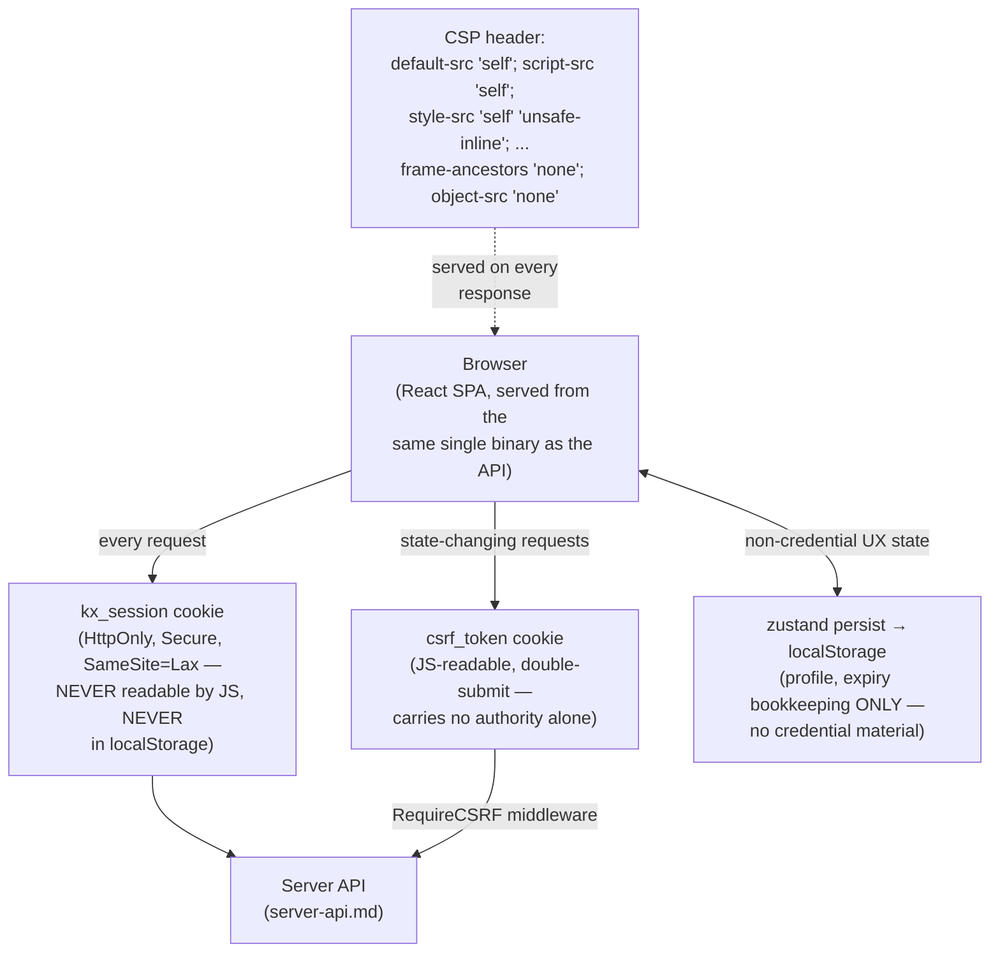

# Threat Model: Web UI

> Part of [`docs/security/threat-models/`](README.md). Derived from
> [`../threat-model.md`](../threat-model.md) §4 (boundary B5) and
> [`../architecture.md`](../architecture.md) §6. This is the one
> component the system-wide threat model's own positioning note flags as
> narrower in scope than the rest: "the rest of the frontend beyond CSP
> and token storage is explicitly out of scope for the 2026-09 review
> and scheduled as its own future pass." That caveat is repeated here
> rather than silently dropped.

## 1. System context

## 2. Trust boundaries

| Boundary (from `../threat-model.md` §3) | What crosses it | Enforcement |
|---|---|---|
| B5 — Web UI ↔ server | Session cookie (`kx_session`) + CSRF double-submit token | `server/middleware/session_cookie.go`; `RequireCSRF`/`csrf.go` |

## 3. STRIDE

- **Spoofing / session theft (XSS).** The session token is delivered
  exclusively via an `HttpOnly`, `Secure`, `SameSite=Lax` cookie — never
  readable by JS, never in `localStorage`. This was a deliberate
  migration away from an earlier `localStorage`-token design, verified
  in the 2026-09 security review's frontend session-token-storage check.
  *Residual*: the accepted CSP `style-src unsafe-inline` finding
  (`#1273`/`#1302`) — investigated and accepted as a documented
  tradeoff (Tailwind/CSS-in-JS runtime style injection needs it), not a
  regression. `script-src` carries **no** such exception
  (`server/middleware/security_headers_test.go` asserts this directly:
  `"no unsafe-inline/unsafe-eval on scripts — the primary XSS vector"`).
- **CSRF.** A JS-readable double-submit `csrf_token` cookie — correct by
  design for this pattern, since it carries no authority on its own
  (an attacker who can read it via XSS already has far worse access).
  Enforced by `RequireCSRF`/`csrf.go`. *Residual*: none identified.
- **Tampering with client-side state.** `zustand`'s `persist` middleware
  writes to `localStorage`, but — verified by reading
  `web/src/store/authStore.ts` directly, not inferred — it holds only
  non-credential bookkeeping (profile fields, expiry timestamps for UX).
  The store deliberately uses `skipHydration` to prevent the persist
  middleware from loading stale `localStorage` values synchronously
  *before* the server validates the session — closing a window where a
  manipulated `auth-storage` entry could pass unchallenged ahead of
  server-side validation. *Residual*: none identified for this
  specific mechanism.
- **Information disclosure — clickjacking / framing.** `frame-ancestors
  'none'` and `object-src 'none'` in the CSP header
  (`server/middleware/security_headers.go`) block the page from being
  framed or from loading legacy plugin content.
- **Information disclosure — the session-restore-on-impersonation-end
  path.** Ending an impersonation session restores the admin's original
  session cookie (or clears it if that session is gone) as part of the
  server response — handled server-side, not by client-side token
  juggling, per `authStore.ts`'s own comments. This keeps the
  client from ever needing to hold two valid session tokens
  simultaneously.

## 4. Residual risks, stated honestly

- **This document inherits the same scope caveat as the system-wide
  threat model.** Beyond CSP headers and token-storage location — the
  two areas the 2026-09 security review actually examined — the rest of
  the frontend (component-level XSS sinks, third-party JS dependency
  risk, build-pipeline supply chain for `web/`) has not been through a
  dedicated review pass as of this writing. This is stated as an open
  scope gap, not claimed as covered.
